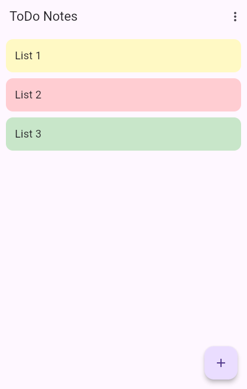
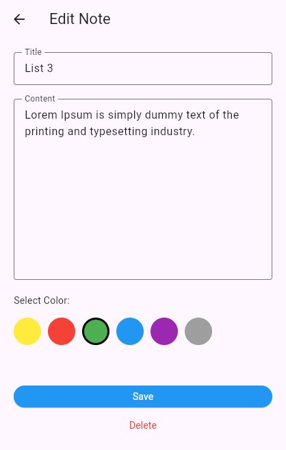

# ToDo Notes
ToDo Notes is a lightweight application that enables users to create, edit, and manage task lists and text-based notes. It features an intuitive interface designed for quick data entry and efficient organization.

### Main

### Editing Note

